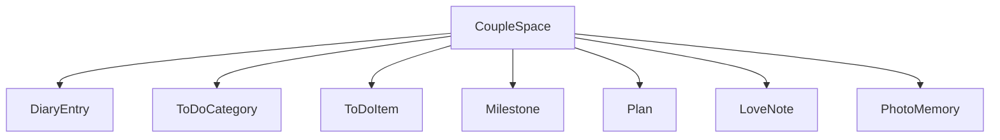
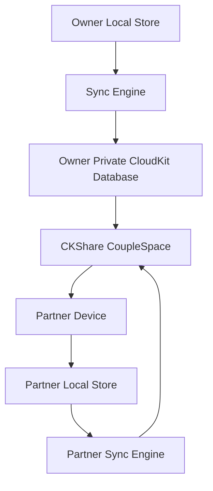

# Dear Diary Architecture Plan

## Decision Summary

Dear Diary will use:

- SwiftUI
- Local-first stores
- iCloud CloudKit Sharing
- One shared `CoupleSpace`
- Opt-in partner sync from Settings
- Simple latest-wins conflict rules
- Soft deletes for synced records
- Clear iCloud privacy copy

This architecture gives the app shared couple data without requiring a custom backend.

## Sync Architecture

Couple sync will use iCloud CloudKit Sharing.

Reasons:

- Users already have Apple ID.
- No separate account system is needed.
- No backend server is needed.
- Data can stay private to the couple.
- Sharing can happen through native iCloud invitations.
- It supports small personal data well: diary entries, to-dos, milestones, plans, notes, and photos.
- Operating cost stays low for an indie app.

Platform stance:

- Dear Diary is Apple-platform first.
- Android or web support later would require a different sync layer or backend.

## Product Principle

Sync will feel invisible.

Target user perception:

> We have one shared diary.

Users do not need to understand records, databases, ownership, or conflict resolution.

The app works offline first. Sync quietly catches up when the network and iCloud are available.

## Sync UX

Sync controls will live in Settings, not as a major Home feature.

Sync states:

- `Not Synced`
- `Invite Partner`
- `Waiting for Partner`
- `Synced`
- `Syncing`
- `Offline Changes Saved`
- `Sync Failed, Will Retry`

Settings copy:

- “Sync with Partner”
- “Invite Partner”
- “Synced with Ting”
- “Leave Shared Diary”
- “Your data syncs through iCloud.”

Home shows sync status only when needed:

- “Syncing...”
- “Offline changes saved”
- “Couldn’t sync. Will retry.”

Avoid always-visible technical sync UI.

## Data Ownership Model

The shared data model has one root object:

```text
CoupleSpace
```

All shared content belongs to this root.

Entities:

- `CoupleSpace`
- `DiaryEntry`
- `ToDoCategory`
- `ToDoItem`
- `Milestone`
- `Plan`
- `LoveNote`
- `PhotoMemory`

High-level relationship:



## CloudKit Sharing Model

Owner creates a `CoupleSpace`.

Share flow:

1. Owner taps `Invite Partner`.
2. App creates a `CKShare` for `CoupleSpace`.
3. Partner accepts native iCloud share invite.
4. Both users read and write records in the shared space.
5. Each device keeps local cached data for offline use.

Sync flow:



## Local-First Model

The app keeps local stores as the source for UI rendering.

Behavior:

- User action writes locally first.
- UI updates immediately.
- Sync engine uploads changes in background.
- Remote changes merge into local store.
- Offline edits are queued.
- Failed sync retries later.

This keeps the app fast and calm.

## Shared Record Fields

All synced records include common metadata:

```yaml
common_fields:
  id: UUID
  coupleSpaceID: UUID
  createdAt: Date
  updatedAt: Date
  deletedAt: Date?
  modifiedByDeviceID: String
  version: Int
```

Purpose:

- `id`: stable identity across devices.
- `coupleSpaceID`: groups records into one shared relationship space.
- `createdAt`: creation ordering.
- `updatedAt`: merge and display ordering.
- `deletedAt`: soft delete support.
- `modifiedByDeviceID`: helps debug and avoid echo loops.
- `version`: enables future migrations and conflict handling.

## Conflict Rules

MVP conflict behavior stays simple.

Default rule:

> Latest valid change wins.

Per-entity rules:

- Diary entries: latest edit wins.
- To-do completion: latest action wins.
- To-do title/details: latest edit wins.
- To-do ordering: sort by `order`, then `updatedAt`, then `id`.
- Milestones: latest edit wins.
- Plans: latest edit wins.
- Love notes: latest edit wins.
- Photos: asset identity wins; replace only when user explicitly changes photo.

Deletes:

- Use soft delete first by setting `deletedAt`.
- Keep tombstones long enough to sync deletion to all devices.
- Hard delete later during cleanup.

## Privacy Model

Privacy stance:

- Sync is opt-in.
- Data syncs through the user’s iCloud account.
- No custom backend stores user data.
- App copy says: “Your data syncs through iCloud.”

Important note:

CloudKit is private and Apple-managed, but this is not the same as adding custom app-level end-to-end encryption for every field.

Future privacy upgrade:

- Optional app-level encryption for diary text and photos.

Trade-offs of app-level encryption:

- Harder search.
- Harder conflict resolution.
- Harder account recovery.
- Harder sharing setup.
- More complex migrations.

Decision:

- Start with normal CloudKit Sharing.
- Add stronger encryption only if product requirements demand it.

## Implementation Phases

### Phase 1: Local Data Model Cleanup

Goal:

- Prepare models for future sync before adding CloudKit.

Work:

- Add shared metadata fields to new models.
- Keep stable `UUID` IDs.
- Design stores around local-first writes.
- Avoid app logic that assumes single-device ownership.

### Phase 2: Diary MVP Without Sync

Goal:

- Build core app identity first.

Work:

- Add diary local store.
- Add diary entries.
- Add latest diary card to Home.
- Keep model shape sync-ready.

### Phase 3: CloudKit Sharing Prototype

Goal:

- Prove couple sync with one record type.

Work:

- Add `CoupleSpace`.
- Add invite flow in Settings.
- Sync one simple entity first, likely `DiaryEntry`.
- Handle accepted share.
- Test two Apple IDs / devices.

### Phase 4: Expand Sync

Goal:

- Bring all shared content into couple space.

Work:

- Sync to-dos.
- Sync milestones.
- Sync plans.
- Sync love notes.
- Sync photos as CloudKit assets.

### Phase 5: Backup and Recovery

Goal:

- Give users safety controls.

Work:

- Export local data.
- Import local data.
- Leave shared space.
- Resolve broken share state.

## Final State

Dear Diary has one shared couple space synced through iCloud. Each device keeps local data for fast offline use, while CloudKit Sharing keeps both partners in sync quietly in the background.

